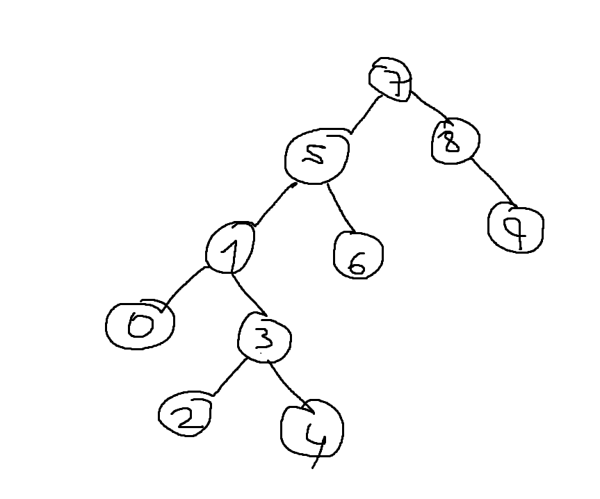

# Proje 3 Binary Search Tree Projesi
[7,5,1,8,3,6,0,9,4,2]

Root 7 dir. Elemanları listedeki sıra ile sağ veya sola atadım.
7 nin solunda 5, sağında 8 vardır. 
5 in solunda 1, sağında 6 vardır.
1 in solunda 0, sağında 3 vardır.
3 ün solunda 2, sağında 4 vardır.
8 in solunda herhangi bir değer yoktur, sağında 9 vardır.

